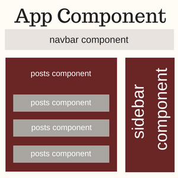
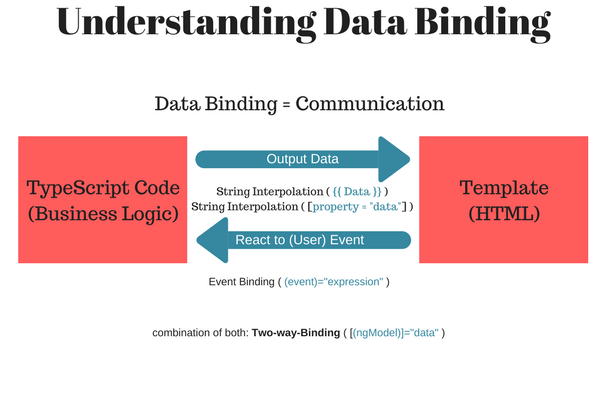

# Components


## Introduction
#### What is component ?

- The bulk of an Angular application.
- Pieces of UI.
- Include a clas and templete.
- Bind from class -> template and class <- template


#### Why use components ?
- Code organization.
- Break up the UI.
- Contain properties & methods.
- Promotes reusability.
- Better teamwork.

#### Application Lifecycle
<p>Angular creates, updates, and destorys components as the user moves through the application. Your app can take action at each moment in this lifecycle through optional lifecycle hooks, like <strong>ngOnInit</strong></p>

## Angular main files

### app.module.ts (default)
It is something like a registry for rest of the application
```TypeScript
import { BrowserModule } from '@angular/platform-browser'; //<- it takes care of display contents on the browser
import { NgModule } from '@angular/core';

import { AppComponent } from './app.component';

@NgModule({
  declarations: //<-- To import components
  [
    AppComponent,
  ],
  imports: //<- For modules
  [
    BrowserModule,
  ],
  providers: [], //<-For service
  bootstrap: [AppComponent]
})
export class AppModule { }

```

### app.component.ts (default)
- It is something like a registry for rest of the application.

```TypeScript
import { Component } from '@angular/core';

@Component({
  selector: 'app-root',
  templateUrl: './app.component.html',
  styleUrls: [./app.component.css]

})
export class AppComponent {

```
### Data Binding and String Interpolation
- We can take data and bind them dynamically to the template by using
- {{  }} called string interplation
- Make sure to use backticks `` to if you want to use your template inside the component
- f
```TypeScript
import { Component } from '@angular/core';

@Component({
  selector: 'app-root',
  templateUrl:
  `
    <h1>{{ name }} is {{  }} years old</h1>
    <h2>My name is {{ person.firstName }} {{person.lastName}}</h2>
  `

})
export class AppComponent {
  name = 'John Doe!';
  age = 35;
  person = {
    firstName: 'Steve',
    lastName: 'Smith'
  }
}

constructor() { } //<- baiscally a function run when a component is initialize

    hasBirthday(){
      this.age += 1; //<- it is not going to run becasue we have not called it in the constructor
    }
}

```

### Adding types to properties

Data Type  | Usage
---       | ---
String | `name:string = 'John Doe'`
Number | `age:number = 35`
Boolean | `hasChildren:bool = true`
Any | `city:any = 'Bosten'`
Arrays of Number | `myNumbersArray:number[] = [1,2,3]`
Arrays of String | `myStringsArray:string[] = ['hello','world']`
Arrays of Any | `myAnyArray:any[] = [1,2,'hello']`
Tuple | `myTuple:[string, number] = ['hello',2]`
unusable | `unusable:void = undefined`
undefined | `u: undefined = undefined`
null | `null = null;`

### Data Binding



- [(ngModel)]="property" two way dataBinding
```
Make Sure to import {FormsModule} from '@angular/forms';
```
- {{  }} string Interpolation
- (event)="" Events binding
```
(click)="onClick"
```


### Selector

selector  | HTML usage
---       | ---
selector: 'app-root' by element| `<app-root></app-root>'`
selector: [app-root] by attribute| `<div app-root><div>`
selector: '.app-root' by class| `<div class="app-root"><div>`


*Side note: selecting by Id won't work it's not working by Angular

### Directives
- Directives are instruction on the DOM

### Objects & Interface

```TypeScript
import { Component } from '@angular/core';

@Component({
  selector: 'app-root',
  templateUrl:
  `
    <h1>{{ name }} is {{  }} years old</h1>
    <h2>My name is {{ person.firstName }} {{person.lastName}}</h2>
  `

})
export class AppComponent {
    customer:{id:number, name:string, email:string} //<- instead of type this object here we can create an interface

    constructor(){
      this.cutomer = {
        id: 1,
        name: 'John Doe',
        email: 'john@gmail.com'
      }
    }

}

```

With Interface included in the same component

```TypeScript
import { Component } from '@angular/core';

@Component({
  selector: 'app-root',
  templateUrl:
  `
    <h1>{{ name }} is {{  }} years old</h1>
    <h2>My name is {{ person.firstName }} {{person.lastName}}</h2>
  `

})
export class AppComponent {
    customer: Customer //<- instead of type this object here we can create an interface

    constructor(){
      this.cutomer = {
        id: 1,
        name: 'John Doe',
        email: 'john@gmail.com'
      }
    }

    interface Customer { // <- interface
        id:number,
        name:string,
        email:string
    }
}

```
Or we make a seperate file for the interface (customer.ts)

```TypeScript
export interface Customer {
        id:number,
        name:string,
        email:string
}
```

and import it in the component

```TypeScript
import { Component } from '@angular/core';
import { Customer } from './customer'

@Component({
  selector: 'app-root',
  templateUrl:
  `
    <h1>Hello Wolrd</h1>
  `

})
export class AppComponent {
    customer: Customer
    customers: Customer[];

    constructor(){
      this.cutomer = {
        id: 0,
        name: 'John Doe',
        email: 'john@gmail.com'
      }

      //we can use array as well

      this.customers = [
        {
          id: 0,
          name: 'John Doe',
          email: 'john@gmail.com'
        },
        {
          id: 1,
          name: 'Brad Jow',
          email: 'jow@gmail.com'
        },
        {
          id: 2,
          name: 'Stevie Brad',
          email: 'Brad@gmail.com'
        }
      ]
    }


}

```

#### ['Events & Forms']()
